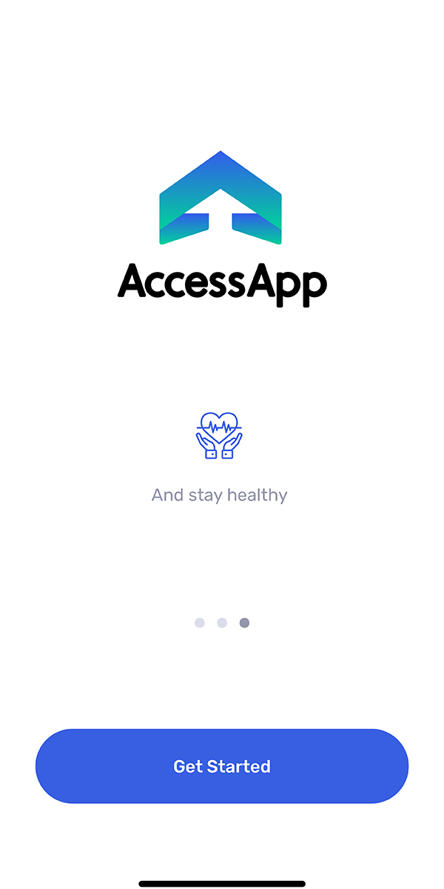

# Places

## What is AccessApp?

AccessApp is a research-informed, not-for-profit booking and discovery platform to allow venues, businesses, attractions and spaces to safely provide uncrowded access to indoor and outdoor spaces thereby protecting the public's health whilst promoting public health information and encouraging the sharing of public health best practice.

Designed as a forward looking, preventative solution in response to the COVID-19 pandemic our project will be led by public health needs and the needs of the wider economy and its functionality and health information will be updated continuously in alignment with the latest government health policy and best practice from industry bodies.

AccessApp is paired with AccessApp Places app which is used by the venues managers to add their 'Place' to the platform and specify their opening and visiting information, their COVID policies and additional saftey precautions in place. The AccessApp Places app also allows create and edit specific timeslots for thier visitors and allows the creation of slots with reduced and managed capacity specifically for those that are vulnerable and shielding as well as managed slots for previously crowded and unmanaged venues, places and spaces to help protect the wider public from COVID exposure.

AccessApp is designed so that venues and venues can add themselves to the platform easily and adopt the system easily within their organisation. Together with this Installation document and accompaniying video there is also a guided walk-thru when you first install the AccessApp Places app which helps you through the process.   

### Where do we come from?

The AccessApp idea was born from an [article](https://voxeu.org/article/easing-lockdown-digital-applications-can-help) published on 1 May 2020 and written by Alice Mesnard and Paul Seabright. The idea was recognised by T.E. Shaw from the Linux Foundation Publish Health and a pilot implementation done w/ the help of Charlie Cox (Digytle) and a crew from Aux Nederland B.V.

### Wikipedia Operational Model (Open Source and Free For ALl)

AccessApp differs from the commercial booking apps in three ways.

* It is open source.
* It is free for all (funded through crowd donations and public funding)
* It focuses on the needs of Places and Visitors, even on the needs of marginal groups, focusing on the value creation, regardless of the commercial value.

### Benefits for Places

**Manage the flow of visitors.** Places can manage the flow of visitors w/ a program, which vocuses on the needs of the Places and on the needs of the Visitors, even and especially on the needs of marginal groups of visitors such as of advanced age, fragile health or shielding due to their contact w/ vulnerable family or friends.

**No financial burden or vendor lock, but material and voluntary support.** Places are unburdened to a maximum extent by the open source and free for all operational model and by the pool of volunteers who help w/ the implementation of AccessApp.

**Marketing** AccessApp helps visitors to search for and discover places, where the measures and the visitor count reverberates w/ their perception of safety.

### Benefits for Visitors

**Focused on their needs.** Free. No ads. Focused on the needs of everybody, also on marginal groups.

**Discovery of places which take Covid seriously.** 

## Implementation Process

This chapter describes the current implementation process of AccessApp at a venue. It is important to understand, that AccessApp is driven by place-centricity and visitor-centricity and the AccessApp crew and community are focused on understanding their minute needs and focus on supporting them in the best possible way.

### What does it cost to the place

free to adapt and use

only minimum involvement of the place

* top management support
* curator supervison
* we take all the work from you which can be done externally
** we find, involve and organise volunteers as much as possible

### Open Source and Free for All

outline the benefits

no vendor lock

true focus on the needs of the places and visitors, especially of marginalised groups w/o business case for commercial vendors

### Integration into the Total Visitory Flow Manaement incl. Marketing, Promotion, planning, hygene concept, statistics, etc.

we take all the work from you which can be done externally 

### Visitor and Place Journeys

AccessApp supports all Visitor and Place journeys.

#### 1. 100% AccessApp based (Places and Visitors)

- Places use the app to advertise themselves and their slots and conditions.
— Visitors use the app to book and enter.

#### 1a Visitor arrives at the door and has no app.

2. 50% AccessApp based (Places)

3. 50% AccessApp based (analogue Visitor, Places is integrated)

4. 0% AccessApp (analogue visitor, Places is integrated)

#### Cooperation w/ Existing IT Vendors

The existing IT vendors are an integral part of the AccessApp ecosystem. AccessApp aims at supporting existing IT vendors, not competing w/ them or replacing them.

AccessApp supports integration w/ booking/ticketing systems.

AccessApp handles all the functionality these system cannot handle.

## Apps

The AccessApp system consists of two (plus one) apps and a Serverless (Jamstack) backend.

AccessApp Visitor provides the Visitor experience.

AccessApp Places allows venues to add and edit themselves.

AccessApp Administrator enables venues that have added themselves (control) and disables venues that have violated the Terms and Conditions.

### PlacesApp

add video how to add and manage your place and also screenshots

## Initial Implementations and related Case Studies

### Implementation/Case Study #1 (Caricature Museum Frankfurt)

The opening is on 1 October 2020.

The challenge:

— outdoor area
— indoor area

Current possibility:

— each area is advertised as a Place
— Visitors book independently slots for each Place (in advance or ad hoc)
— there are checkin/checkout points into/out of each Place (we need to complete the bardcode part)

Unresolved questions:

— how to handle the visitors w/o apps?
  — one possibility is to have people to tap in/out button on the app
    — this way human error as to the actual count can sneak in
      — how critical would that be?

### Implementation/Case Study #2 (Jewish Museum Frankfurt)
